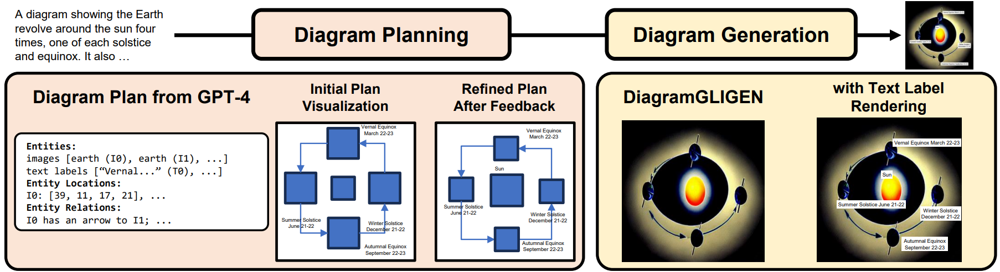

# DiagrammerGPT: Generating Open-Domain, Open-Platform Diagrams via LLM Planning

Official implementation of **DiagrammerGPT**, a novel two-stage text-to-diagram generation framework that leverages the layout guidance capabilities of LLMs to generate more accurate open-domain, open-platform diagrams.


[](https://arxiv.org/abs/2310.12128) [](https://diagrammerGPT.github.io/)


[Abhay Zala](https://aszala.com/),
[Han Lin](https://hl-hanlin.github.io/),
[Jaemin Cho](https://j-min.io),
[Mohit Bansal](https://www.cs.unc.edu/~mbansal/)


### Code Release Todo List
- [x] Diagram Plan Generation Source Code
- [ ] Diagram Generation Source Code
- [ ] AI2D-Caption Dataset Release

<br>

<br>

An overview of DiagrammerGPT, our two-stage framework for open-domain, open platform diagram generation.
- In the first diagram planning stage, given a prompt, our LLM (GPT-4) generates a <i>diagram plan</i>, which consists of dense entities (objects and text labels), fine-grained relationships (between the entities), and precise layouts (2D bounding boxes of entities). Then, the LLM iteratively refines the diagram plan (i.e., updating the plan to better align with the input prompts).
- In the second diagram generation stage, our DiagramGLIGEN outputs the diagram given the diagram plan, then, we render the text labels on the diagram.

<br>


# Generated Examples

<table class="center">
    <tr>
        <td style="text-align:center;font-weight:bold;" width="300">Input Prompt</td>
        <td style="text-align:center;font-weight:bold;" width="300">Diagram Plan</td>    
        <td style="text-align:center;font-weight:bold;" width="300">Generated Diagram</td> 
    </tr>
    <tr>
        <td style="text-align:center;" width="300">A diagram showing the layers of the earth. It includes the inner and outer cores, the mantle, and the crust.</td>
        <td></td>
        <td></td>
    </tr>
    <tr>
        <td style="text-align:center;" width="300">A diagram showing the Earth's position in four phases as it revolves around the sun.</td>
        <td></td>
        <td></td>
    </tr>
    <tr>
        <td style="text-align:center;" width="300">A diagram showing three rows of rocks. Each row has 5 rocks. The first row shows different types of igneous rocks, including granite, diorite, felsite, basalt, and obsidian. The second row shows different types of sedimentary rocks, including conglomerate, sandstone, shale, limestone, and dolomite. The third row shows different types of metamorphic rocks, including slate, schist, serpentine, quartzite, and marble. Include a label for the type of rock each row shows and each rock.</td>
        <td></td>
        <td></td>
    </tr>
</table>

# Examples Rendered with Other Platforms


<table class="center">
    <tr>
        <td style="text-align:center;font-weight:bold;" width="300">Input Prompt</td>
        <td style="text-align:center;font-weight:bold;" width="300">Rendered with Microsoft PowerPoint</td>    
        <td style="text-align:center;font-weight:bold;" width="300">Rendered with Inkscape</td> 
    </tr>
    <tr>
        <td style="text-align:center;" width="300">A diagram showing two
            food chains. The left food
            chain, starting from the
            bottom, goes from lichen,
            to slug, to toad, to snake,
            to eagle. The right food
            chain, starting from the
            bottom, goes from algae, to
            snail, to crayfish, to fish, to
            alligator.
        </td>
        <td></td>
        <td></td>
    </tr>
    <tr>
        <td style="text-align:center;" width="300">A diagram showing the
            eight phases of the moon
            with labels as it revolves
            around Earth. It also
            indicates the direction of
            the sunlight.
        </td>
        <td></td>
        <td></td>
    </tr>
</table>

# Citation

If you find our project useful in your research, please cite the following paper:

```bibtex
@article{Zala2023DiagrammerGPT,
        author = {Abhay Zala and Han Lin and Jaemin Cho and Mohit Bansal},
        title = {DiagrammerGPT: Generating Open-Domain, Open-Platform Diagrams via LLM Planning},
        year = {2023},
}
```
